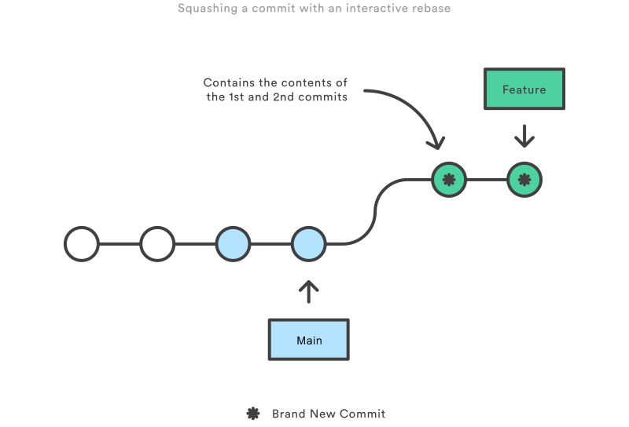
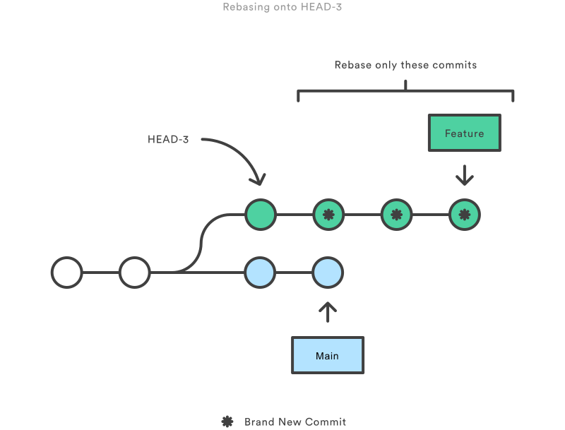

# rebase

O comando `git rebase` move ou combina uma sequência de _commits_ para um novo _commit_ base.

```bash
git rebase <base-destino>
```

O Git _rebase_ no modo padrão pegará automaticamente os _commits_ em sua _branch_ de trabalho atual e as aplicará à cabeça da _branch_ passada.

Isso rebaseia automaticamente a _branch_ atual na `<base-destino>`, que pode ser qualquer tipo de referência de _commit_ (por exemplo, um ID, um nome de _branch_, uma _tag_ ou uma referência relativa a _HEAD_).

O processo geral pode ser visualizado da seguinte forma:


O comando `git rebase` permite reordenar, recodificar, mesclar e revisitar seus commits com facilidade; isso é extremamente útil quando você está trabalhando em várias _branchs_ diferentes e quer trazer um conjunto de alterações de outra _branch_.

O Git mantém automaticamente um histórico de desenvolvimento em um _branch_ vinculando cada novo _commit_ ao seu antecessor. Quando você mescla uma _branch_ em outra, o histórico pode se tornar menos simples. Por exemplo, uma mesclagem sem avanço rápido (_fast-forward_) combina linhas divergentes de desenvolvimento criando um _commit_ de mesclagem com vários predecessores. Por outro lado, um _rebase_ do Git combina linhas divergentes de desenvolvimento sem criar um _commit_ de mesclagem, o que resulta em um histórico de _commit_ mais simples, mas perdendo informações sobre a mesclagem. Sua escolha de tipo de mesclagem provavelmente é influenciada por você querer preservar um registro da mesclagem ou simplificar o histórico de _commits_.

Do ponto de vista do conteúdo, _rebase_ é alterar a base de sua _branch_ de um _commit_ para outro, fazendo com que pareça que você criou sua _branch_ a partir de um _commit_ diferente. Internamente, o Git realiza isso criando novos _commits_ e aplicando-os à base especificada. É muito importante entender que, embora a _branch_ pareça a mesma, ela é composta de _commits_ inteiramente novos.

A principal razão para o _rebase_ é manter um histórico de projeto linear. Por exemplo, considere uma situação em que a _branch_ __principal__ progrediu desde que você começou a trabalhar em uma _branch_ __secundaria__. Você deseja obter as atualizações mais recentes da _branch_ __principal__ em sua _branch_ __secundaria__, mas deseja manter o histórico da _branch_ limpo para que pareça que você está trabalhando recente na _branch_ __principal__. Isso dá o benefício posterior de uma mesclagem limpa de sua _branch_ __secundaria__ de volta para a _branch_ __principal__. Por que queremos manter uma "histórico limpo"? Os benefícios de ter um histórico limpo tornam-se tangíveis ao realizar operações Git para investigar a introdução de uma regressão. Um cenário mais real seria:

1. Um bug é identificado na _branch_ __principal__. Um recurso que estava funcionando com êxito agora está quebrado.

1. Um desenvolvedor examina o histórico da _branch_ __principal__ usando `git log`, por causa do "histórico limpo", o desenvolvedor é rapidamente capaz de raciocinar sobre o histórico do projeto.

1. O desenvolvedor não pode identificar quando o bug foi introduzido usando `git log` então o desenvolvedor execute `git bisect`.

1. Como o histórico do git é limpo, `git bisect` tem um conjunto refinado de _commits_ para comparar ao procurar a regressão. O desenvolvedor encontra rapidamente o _commit_ que introduziu o bug e é capaz de agir de acordo.

Você tem duas opções para integrar seu recurso à _branch_ __principal__: mesclar diretamente ou realizar _rebase_ e, em seguida, mesclar. A primeira opção resulta em uma mesclagem de 3 vias e um _commit_ de mesclagem, enquanto a última resulta em uma mesclagem em _fast-forward_ e um histórico perfeitamente linear.

## Comandos

O `git rebase` também há opções de argumentos que podem ser úteis em aplicativos mais complexos.

- `git rebase --d`: significa que, durante a reprodução, o _commit_ será descartado do bloco de _commit_ combinado final.
- `git rebase --p`: deixa o _commit_ como está. Ele não modificará a mensagem ou o conteúdo do _commit_ e ainda será um _commit_ individual no histórico de _branches_.
- `git rebase --x`: durante a reprodução executa um script de shell de linha de comando em cada _commit_ marcado. Um exemplo útil seria executar o conjunto de testes da sua base de código em _commits_ específicos, o que pode ajudar a identificar regressões durante um _rebase_.
- `git rebase --onto <base-nova> <base-antiga>`: permite que a passagem de _refs_ específicos sejam as pontas de uma _rebase_.
    - Dado o exemplo abaixo, `featureB` é baseado em `featureA`, no entanto, percebemos que `featureB` não é dependente de nenhuma das alterações no `featureA` e poderia apenas ser ramificado fora do `main`.

    ```txt
     o---o---o---o---o  main
          \
           o---o---o---o---o  featureA
                \
                 o---o---o  featureB
    ```

    ```bash
    git rebase --onto main featureA featureB
    ```

    A _branch_ `main` é a `<base-nova>` e `featureA` a `<base-antiga>`, já `featureB` é a referência para o qual o _HEAD_ da `<base-nova>` irá apontar. Os resultados serão:

    ```txt
                      o---o---o  featureB
                     /
    o---o---o---o---o  main
     \
      o---o---o---o---o  featureA
    ```

## Git Rebase Interativo

A execução de `git rebase` com a _flag_ `-i` ou `--interactive` inicia uma sessão de _rebase_ interativa. Em vez de mover cegamente todos os _commits_ para a nova base, o _rebase_ interativo lhe dá a oportunidade de alterar _commits_ individuais no processo. Isso permite que você limpe o histórico removendo, dividindo e alterando uma série existente de _commits_. É como o comando `git commit --amend` mas com esteroides.

```bash
git rebase -i <base-destino>
```

Isso rebaseia a _branch_ atual na `<base-destino>`, mas usa uma sessão de _rebase_ interativa. Isso __abre um editor__ onde você pode inserir comandos (descritos abaixo) para cada _commit_ a ser rebaseado. Esses comandos determinam como os _commits_ individuais serão transferidas para a nova base. Você também pode reordenar a listagem de _commits_ para alterar a ordem dos _commits_. Depois de especificar comandos para cada _commit_ no _rebase_, o Git começará a reproduzir _commits_ aplicando os comandos de _rebase_.

A maioria dos desenvolvedores gosta de usar um _rebase_ interativo para polir uma _branch_ de recurso antes de mesclá-la na base de código principal. Isso lhes dá a oportunidade de esmagar (_squash_) _commits_ insignificantes, excluir os obsoletos e garantir que todo o resto esteja em ordem antes do _commit_ com o histórico "oficial" do projeto. Para todos os outros, parecerá que todo o recurso foi desenvolvido em uma única série de _commits_ bem planejados.

No exemplo abaixo vamos supor que criamos uma _branch_ `feature` e queremos limpar um histórico confuso antes de mesclar a _branch_ `feature` no `main`.

```bash
# Cria branch feature baseada na main
git checkout -b feature main
git commit -a -m "Adds new feature 1" 
git commit -a -m "Adds new feature 2" 
git commit -a -m "Adds new feature 3" 
```

Ao realizar o comando `git rebase -i main`, será aberto o editor com o seguinte texto abaixo, com os _commits_ que serão movidos e os comandos possíveis (além de `pick`):

```ini
pick 51b5b0d Adds new feature 1
pick 437253e Adds new feature 2
pick 5c67e61 Adds new feature 3

# Rebase 76cbe39..437253e onto 76cbe39 (2 commands)
#
# Commands:
# p, pick <commit> = use commit
# r, reword <commit> = use commit, but edit the commit message
# e, edit <commit> = use commit, but stop for amending
# s, squash <commit> = use commit, but meld into previous commit
# f, fixup [-C | -c] <commit> = like "squash" but keep only the previous
#                    commit's log message, unless -C is used, in which case
#                    keep only this commit's message; -c is same as -C but
#                    opens the editor
# x, exec <command> = run command (the rest of the line) using shell
# b, break = stop here (continue rebase later with 'git rebase --continue')
# d, drop <commit> = remove commit
# l, label <label> = label current HEAD with a name
# t, reset <label> = reset HEAD to a label
# m, merge [-C <commit> | -c <commit>] <label> [# <oneline>]
# .       create a merge commit using the original merge commit's
# .       message (or the oneline, if no original merge commit was
# .       specified); use -c <commit> to reword the commit message
```

Essa listagem define exatamente como será a _branch_ depois que a _rebase_ for executada. Ao alterar o comando e/ou reordenar as entradas, você pode fazer com que o histórico da _branch_ se pareça com o que quiser. Por exemplo, se o 2° _commit_ corrigir um pequeno problema no 1° _commit_, você poderá condensá-los em um único _commit_ com o comando `fixup`.

```txt
pick  51b5b0d Adds new feature 1
fixup 437253e Adds new feature 2
pick  5c67e61 Adds new feature 3
```

Quando você salva e fecha o arquivo, o Git executará o _rebase_ de acordo com suas instruções, resultando em um histórico do projeto semelhante ao seguinte:



Eliminar _commits_ insignificantes como essa torna o histórico da `feature` muito mais fácil de entender. Isso é algo que simplesmente não pode fazer com `git merge`.

## Configurações

Existem algumas propriedades de _rebase_ que podem ser definidas usando o `git config`. Essas opções alterarão a aparência da saída do `git rebase`.

- `rebase.stat`: Um booleano que é definido como false por padrão. A opção alterna a exibição do conteúdo visual do `diffstat` que mostra o que mudou desde a última _rebase_.
- `rebase.autoSquash`: Um valor booleano que alterna o comportamento do `--autosquash`.
- `rebase.missingCommitsCheck`: Pode ser definido como vários valores que alteram o comportamento de _rebase_ em torno de _commits_ ausentes.
    - `warn`: Imprime a saída de aviso no modo interativo que avisa sobre _commits_ removidos.
    - `error`: Interrompe a _rebase_ e imprime mensagens de aviso de _commits_ removidos.
    - `ignore`: Ignora todos os avisos de _commits_ ausentes (__definido por padrão__).
- `rebase.instructionFormat`: O formato em _string_ do `git log` que será usada para formatar a exibição interativa da _rebase_.

## Quando não usar

Você nunca deve realizar _rebase_ de _commits_ depois que eles forem enviados para uma _branch_ pública. O _rebase_ substituiria os _commits_ antigos por novos e pareceria que essa parte do histórico do seu projeto desapareceu abruptamente.

Por exemplo, pense no que aconteceria se você rebasear  `main` na _branch_ `feature`:


O _rebase_ move todos os _commits_ de `main` para a ponta de `feature`. O problema é que isso só aconteceu no seu repositório. Todos os outros desenvolvedores ainda estão trabalhando com o `main` original. Como o _rebase_ resulta em novos _commits_, o Git pensará que a história da sua _branch_ `main` divergiu da de todos os outros.

A única maneira de sincronizar as duas _branchs_ `main` é mesclá-las novamente, resultando em um _commit_ de _merge_ extra e dois conjuntos de _commits_ que contêm as mesmas alterações (as originais e as da _branchs_ rebaseadas). Podemos dizer que esta é uma situação muito confusa.

Então, antes de executar `git rebase`, sempre pergunte a si mesmo: "Alguém mais está olhando para esta _branch_?" Se a resposta for sim, tire as mãos do teclado e comece a pensar em uma maneira não destrutiva de fazer suas alterações (por exemplo, o comando `git revert`). Caso contrário, você está seguro para reescrever a história o quanto quiser.

### Push forçado

Se você tentar _push_ da _branch_ `main` rebaseada de volta para um repositório remoto, o Git impedirá que você faça isso porque ele entra em conflito com a branch `main` remota. Mas você pode forçar o push passando a _flag_ `--force`, assim:

```bash
git push --force
# Tenha muito cuidado com este comando! 
```

Isso sobrescreve a _branch_ `main` remota para corresponder a rebaseada de seu repositório e torna as coisas muito confusas para o restante de sua equipe. Portanto, tenha muito cuidado para usar este comando somente quando souber exatamente o que está fazendo.

Uma das únicas vezes em que você deve forçar o _push_ é quando você executou uma limpeza local depois de realizar _push_ de uma _branch_ `feature` privada para um repositório remoto (por exemplo, para fins de backup). Isso é como dizer: "Opa, eu realmente não queria realizar _push_ dessa versão original da _branch_ `feature`. Em vez disso, pegue a atual". Novamente, é importante que ninguém esteja trabalhando nos _commits_ da versão original da _branch_ `feature`.

## Diferença entre _rebase_ e _merge_

A primeira coisa a entender sobre `git rebase` é que ele resolve o mesmo problema que o `git merge`. Ambos os comandos são projetados para integrar alterações de uma _branch_ em outra _branch_, mas eles fazem isso de maneiras muito diferentes.

Considere o que acontece quando você começa a trabalhar em um novo recurso em uma _branch_ `feature` dedicada e, em seguida, outro membro da equipe atualiza a _branch_ `main` com novos _commits_. Isso resulta em um histórico bifurcado, como a figura abaixo:


Agora, digamos que os novos _commits_ em `main` sejam relevantes para a `feature` em que você está trabalhando. Para incorporar os novos _commits_ em sua _branch_, você tem duas opções: __mesclar__ (_merge_) ou __rebasear__ (_rebase_).

### A opção _merge_

A opção mais fácil é mesclar a _branch_ `main` na _branch_ `feature` do recurso é usando algo como o seguinte:

```bash
git merge <branch-origem> <branch-destino>
# Exemplo: git merge feature main
```

Isso cria um novo _commit_ de _merge_ na _branch_ `feature` que une os históricos de ambas as _branch_, fornecendo uma estrutura de _branch_ semelhante a esta:


O _merge_ é boa opção porque é uma operação __não destrutiva__. As _branchs_ existentes não são alteradas de forma alguma. Isso evita todas as armadilhas potenciais do _rebase_.

Por outro lado, isso também significa que a _branch_ `feature` terá um _commit_ de _merge_ estranho toda vez que você precisar incorporar alterações _upstream_. Se `main` for muito ativo, isso pode poluir um pouco o histórico da _branch_ `feature`. Embora seja possível atenuar esse problema com opções avançadas, isso pode dificultar a compreensão do histórico do projeto por outros desenvolvedores.

### A opção _rebase_

Como alternativa ao _merge_, podemos rebasear a _branch_ `feature` na _branch_ `main` usando os seguintes comandos:

```bash
git checkout feature
git rebase main
```

Isso move toda a _branch_ `feature` para começar na ponta da _branch_ `main`, incorporando efetivamente todos os novos _commits_ em `main`. Mas, em vez de usar um _commit_ de _merge_, o _rebase_ reescreve o histórico do projeto criando novos _commits_ para cada _commit_ na _branch_ original.


O principal benefício da _rebase_ é que você obtém um histórico de projeto muito mais limpo. Primeiro, ele elimina os _commits_ de _merge_ desnecessários exigidas pelo `git merge`. Em segundo lugar, o _rebase_ também resulta em um histórico de projeto perfeitamente linear - você pode seguir da ponta de `feature` até o início do projeto sem bifurcações. Isso facilita a navegação em seu projeto com comandos `git log`, `git bisect`, e `gitk`.

Mas, existem dois _trade-offs_ para esse histórico de _commits_ intocado: segurança e rastreabilidade. Se estiver usando uma _branch_ pública, reescrever o histórico do projeto pode ser potencialmente catastrófico para o seu fluxo de trabalho de colaboração. E, menos importante, o _rebase_ perde o contexto fornecido por uma _commit_ de _merge_ - você não pode ver quando as alterações _upstream_ foram incorporadas a `feature`.

### Fluxo de trabalho

A primeira etapa em qualquer fluxo de trabalho que aproveita o `git rebase` é criar uma _branch_ dedicada para cada `feature`. Isso fornece a estrutura de _branch_ necessária para utilizar o _rebase_ com segurança:


#### Limpeza local

Uma das melhores maneiras de incorporar o _rebase_ em seu fluxo de trabalho é limpar as `features` locais em andamento. Ao executar periodicamente um _rebase_ interativo, você pode garantir que cada _commit_ em sua `feature` seja focado e significativo. Isso permite que você escreva seu código sem se preocupar em dividi-lo em _commits_ isolados - você pode corrigi-lo posteriormente.

Ao chamar git _rebase_, você tem duas opções para a nova base: a _branch_ pai da `feature` (por exemplo, `main`) ou um _commit_ anterior em sua `feature`. A última opção é boa quando você só precisa corrigir os últimos _commits_. Por exemplo, o comando a seguir inicia um _rebase_ interativo apenas dos últimos 3 _commits_.

```bash
git checkout feature git rebase -i HEAD~3
```

Ao especificar `HEAD~3` como a nova base, você não está realmente movendo a _branch_ - você está apenas reescrevendo interativamente os 3 _commits_ que o seguem. Observe que isso não incorporará alterações _upstream_ na _branch_ do `feature`.



Se você quiser reescrever toda a `feature` usando este método, o comando `git merge-base` pode ser útil para encontrar a base original da _branch_ da `feature`. O seguinte retorna o ID de _commit_ da base original, que você pode passar para o `git rebase`:

```bash
git merge-base feature main
```

Esse uso de _rebase_ interativo é uma ótima maneira de introduzir `git rebase` em seu fluxo de trabalho, pois afeta apenas _branchs_ locais. A única coisa que os outros desenvolvedores verão é o seu produto finalizado, que deve ser um histórico de _branch_ da `feature` limpo e fácil de seguir.

Mas, novamente, isso só funciona para _branchs_ de `features` privadas. Se você estiver colaborando com outros desenvolvedores por meio da mesma _branch_ `feature`, esse _branch_ é pública e você não tem permissão para reescrever seu histórico.

> __Note__
> Não há alternativa `git merge` para limpar _commits_ locais assim como um _rebase_ interativo.

#### Incorporando alterações _upstream_ em um `feature`

Vimos como um _branch_ `feature` pode incorporar alterações _upstream_ do `main` usando `git merge` ou `git rebase`. O _merege_ é uma opção segura que preserva todo o histórico do seu repositório, enquanto o _rebase_ cria um histórico linear movendo sua _branch_ `feature` para a ponta da `main`.

Esse uso do `git rebase` é semelhante a uma limpeza local (e pode ser executado simultaneamente), mas no processo ele incorpora os _commits_ _upstream_ da `main`.

Lembre-se de que é perfeitamente legal fazer o _rebase_ em uma _branch_ remota em vez de `main`. Isso pode acontecer ao colaborar no mesmo `feature` com outro desenvolvedor e você precisa incorporar as alterações dele em seu repositório.

Por exemplo, se você e outro desenvolvedor chamado John adicionaram _commits_ a _branch_ `feature`, seu repositório pode se parecer com o seguinte depois de um _fetching_ da _branch_ `feature` remota do repositório de John:


Você pode resolver essa bifurcação exatamente da mesma maneira que integra as alterações _upstream_ de `main`: _merge_ da sua `feature` local com a `john/feature` ou rebasear seu `feature` local na ponta de `john/feature`.


Observe que este _rebase_ não interferer na _branch_ pública porque apenas seus _commits_ de `feature` locais estão sendo movidos - tudo antes disso permanece intocado. Isso é como dizer: "adicione minhas alterações ao que John já fez". Na maioria das circunstâncias, isso é mais intuitivo do que sincronizar com a _branch_ remota por meio de um _commit_ de _merge_.

> __Note__
> Por padrão, o comando `git pull` executa um _merge_, mas você pode forçá-lo a integrar a _branch_ remota com um _rebase_ passando a opção `--rebase`.

#### Revendo um `feature` com um _pull request_

Se você usar _pull request_ como parte do processo de revisão de código, precisará evitar o uso de `git rebase` após criar o _pull request_. Assim que você fizer o _pull request_, outros desenvolvedores estarão olhando seus _commits_, o que significa que é uma _branch_ pública. Reescrever seu histórico tornará impossível para o Git e seus colegas de equipe rastrear quaisquer _commits_ adicionados ao `feature`.

Quaisquer alterações de outros desenvolvedores precisam ser incorporadas com `git merge` em vez de `git rebase`.

Por esse motivo, geralmente é uma boa ideia limpar seu código com um _rebase_ interativo antes de enviar um _pull request_.

#### Integrando um `feature` aprovado

Depois que uma `feature` foi aprovada por sua equipe, você tem a opção de rebasear a `feature` na ponta da _branch_ `main` antes de usar o `git merge` para integrar a `feature` à base de código `main`.

Esta é uma situação semelhante à incorporação de alterações _upstream_ em uma _branch_ de `feature`, mas como você não tem permissão para reescrever _commits_ na _branch_ `main`, você deve eventualmente usar o `git merge` para integrar a `feature`. No entanto, ao realizar um _rebase_ antes do _merge_, você tem certeza de que o _merge_ será _fast-forwarded_, resultando em um histórico perfeitamente linear. Isso também lhe dá a chance de fazer _squash_ de quaisquer _commits_ adicionados durante uma _pull request_.


Se você não estiver totalmente confortável com o `git rebase`, sempre poderá executar o _rebase_ em uma _branch_ temporária. Dessa forma, se você acidentalmente bagunçar o histórico do seu `feature`, poderá verificar a _branch_ original e tentar novamente. Por exemplo:

```bash
git checkout feature
git checkout -b temporary-branch
git rebase -i main
# limpar o histórico
git checkout main
git merge temporary-branch
```

## Referências

- <https://www.atlassian.com/git/tutorials/rewriting-history/git-rebase>
- <https://git-scm.com/docs/git-rebase/pt_BR>
- <https://learn.microsoft.com/pt-br/azure/devops/repos/git/rebase>
- <https://www.atlassian.com/git/tutorials/merging-vs-rebasing#the-golden-rule-of-rebasing>
